# Storyverse — como o app funciona

Documento de referência do projeto: telas, fluxos, banco de dados, arquivos e serviços externos.
Os diagramas são [Mermaid](https://mermaid.js.org/) e aparecem desenhados no GitHub e no VS Code
(extensão "Markdown Preview Mermaid Support").

**Sumário**

1. [Visão geral](#1-visão-geral)
2. [Mapa de telas](#2-mapa-de-telas)
3. [Conta: cadastro, login e sessão](#3-conta-cadastro-login-e-sessão)
4. [Abrir e ler um livro](#4-abrir-e-ler-um-livro)
5. [Importar um livro](#5-importar-um-livro)
6. [Acervo da comunidade e moderação](#6-acervo-da-comunidade-e-moderação)
7. [Capas dos livros](#7-capas-dos-livros)
8. [Dados da conta: aparelho e nuvem](#8-dados-da-conta-aparelho-e-nuvem)
9. [Perfil: fotos e painel de leitura](#9-perfil-fotos-e-painel-de-leitura)
10. [Chat com personagens (IA)](#10-chat-com-personagens-ia)
11. [Pessoas online](#11-pessoas-online)
12. [App instalável, offline e botão voltar](#12-app-instalável-offline-e-botão-voltar)
13. [Banco de dados (Supabase)](#13-banco-de-dados-supabase)
14. [Storage (arquivos)](#14-storage-arquivos)
15. [Dados guardados no aparelho](#15-dados-guardados-no-aparelho)
16. [Serviços externos e proxies](#16-serviços-externos-e-proxies)
17. [Variáveis de ambiente](#17-variáveis-de-ambiente)
18. [Mapa do código](#18-mapa-do-código)
19. [Configurar um Supabase novo](#19-configurar-um-supabase-novo)

---

## 1. Visão geral

O Storyverse é um **PWA** (React 18 + Vite + TypeScript) publicado na **Vercel**. Não há servidor
próprio: o navegador fala direto com o **Supabase** (contas, banco, arquivos, tempo real) e com
serviços públicos (Project Gutenberg, Open Library, tradução, IA). As regras de segurança ficam
no banco (RLS), não na tela.

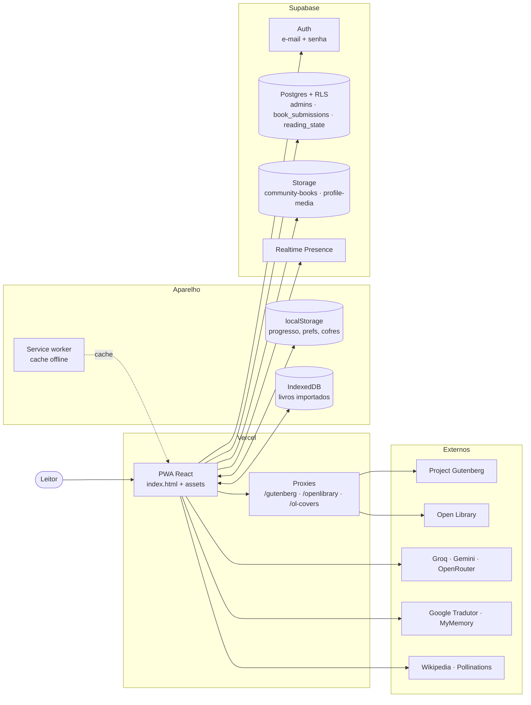

---

## 2. Mapa de telas

Quase tudo vive em `src/App.tsx`. As "telas" são estados do componente principal, não rotas.
Cada janela aberta empilha um passo no histórico para o botão voltar do celular fechá-la
(ver [§12](#12-app-instalável-offline-e-botão-voltar)).

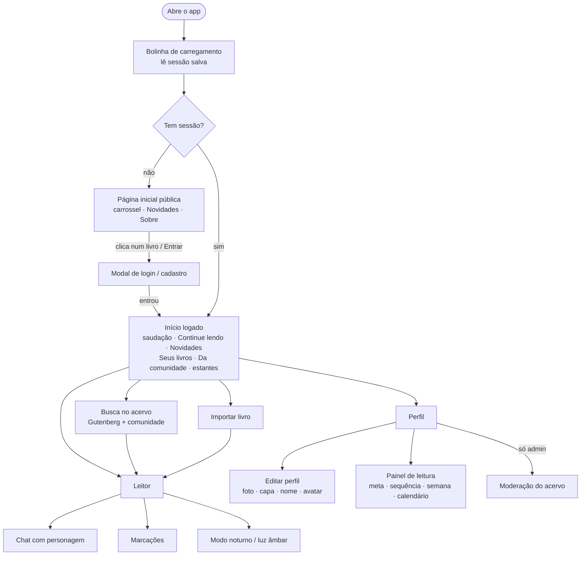

---

## 3. Conta: cadastro, login e sessão

Código: `src/lib/auth.ts`. Fala com a API REST do Supabase Auth (`/auth/v1/*`) sem o SDK.
O e-mail de confirmação sai pelo **SMTP próprio** (Gmail da Codeplus) com os modelos de
`supabase/templates/`.

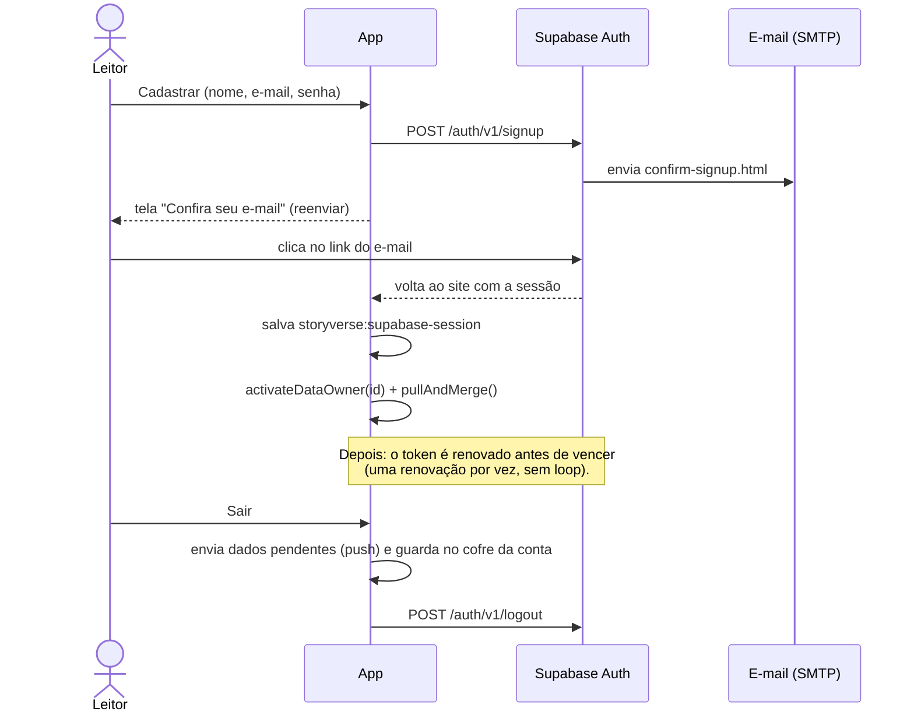

- `VITE_LOGIN_REQUIRED=false` deixa a conta opcional. Sem as variáveis do Supabase o app funciona
  sem contas.
- **Esqueci a senha** usa `reset-password.html`.

---

## 4. Abrir e ler um livro

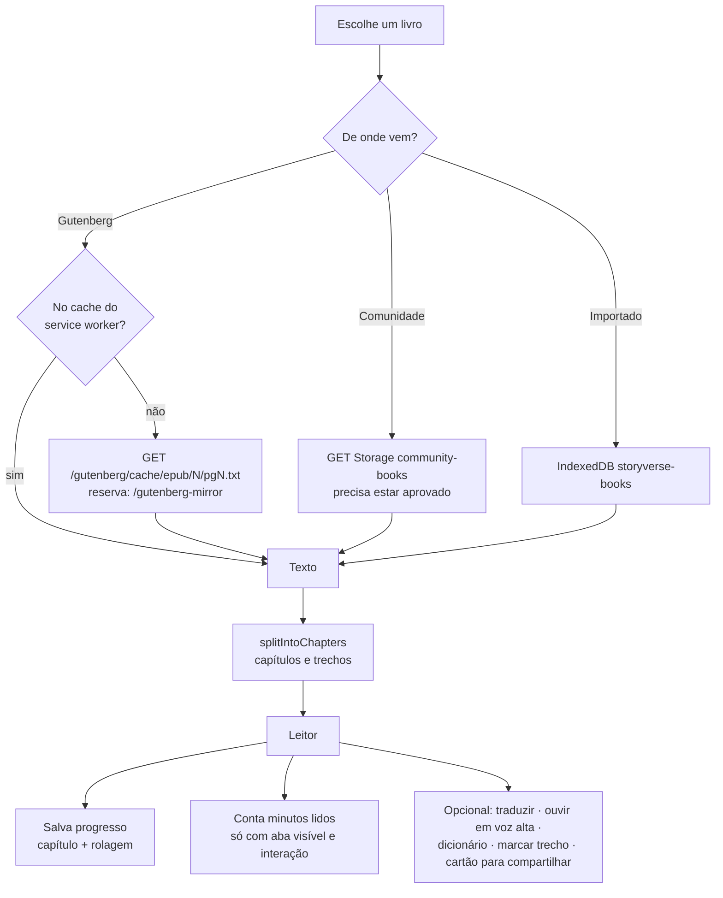

- **Tradução** (`translate.ts`): tradutor embutido do navegador, depois Google Tradutor, depois
  MyMemory. Fica guardada no aparelho (`storyverse:tr2:*`).
- **Voz** (`speech.ts`): Web Speech API do próprio aparelho, um parágrafo por vez.
- **Dicionário** (`dictionary.ts`): Wikcionário (pt/en).

---

## 5. Importar um livro

Código: `src/lib/importBook.ts`, `src/lib/localBooks.ts` e o componente `MyBooks` em `App.tsx`.
O arquivo é lido **no navegador**, sem IA.

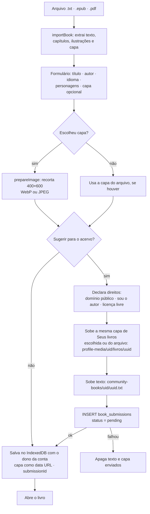

Ao entrar, `syncSubmissionCovers` confere os envios da pessoa: se a capa do acervo não foi enviada
pelo app (vazia ou da Open Library) e o livro em "Seus livros" tem capa, sobe essa capa e grava no
envio pela função `set_submission_cover`. Assim "Novidades" e "Da comunidade" mostram a mesma capa.

Remover um livro de "Seus livros" apaga **só a cópia do aparelho** (texto, progresso, marcações,
chat). Um envio ao acervo continua existindo.

---

## 6. Acervo da comunidade e moderação

Código: `src/lib/community.ts` e o painel de moderação em `App.tsx`. Admin = quem está na tabela
`admins` (função `is_admin()`).

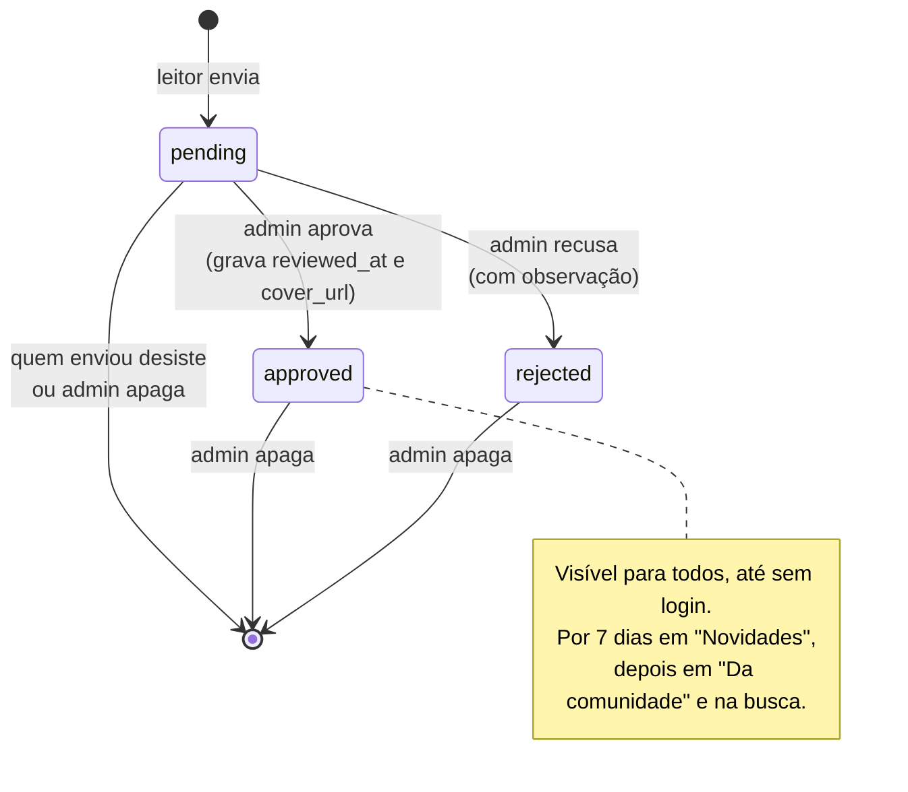

Ao apagar um envio saem o registro, o texto (`community-books`) e a capa enviada
(`profile-media/.../livros/...`). Capas da Open Library não ficam no Storage.

### Aprovação

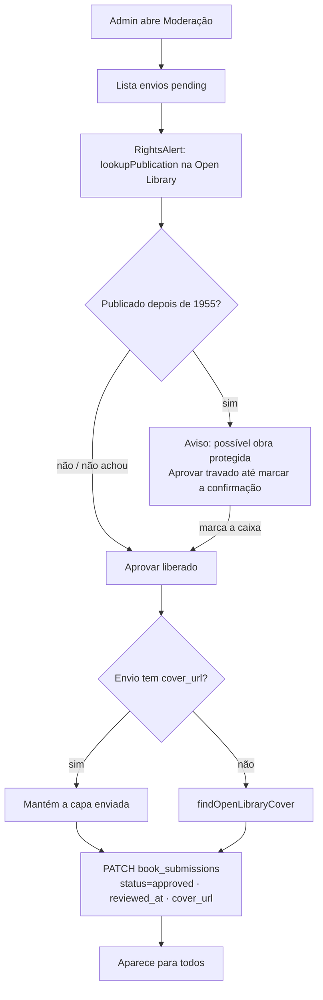

Na Moderação, cada envio (em análise ou publicado) mostra a capa atual e o botão **Trocar capa**:
o admin escolhe uma imagem do aparelho, ela é recortada em 400×600, sobe para
`profile-media/<uid do admin>/livros/<uuid>` (`changeSubmissionCover`) e substitui `cover_url`. A
capa enviada antes é apagada. Capa enviada pelo app não é trocada pela sincronização de quem enviou.

> **Regra do projeto:** só entram obras em domínio público, do próprio autor ou com licença livre.
> Obras protegidas são recusadas ou removidas, nunca ajustadas para aparecer.

---

## 7. Capas dos livros

Código: `BookCover` em `App.tsx`, `src/lib/bookCovers.ts`, `src/lib/openLibrary.ts`.

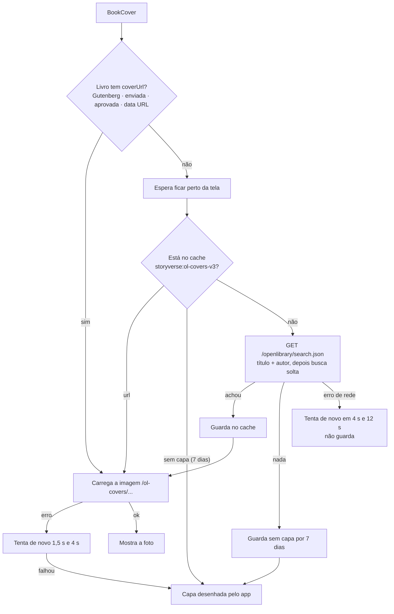

As imagens passam pelo proxy da Vercel (mesma origem). O service worker guarda as capas em
`storyverse-images-v2` e só guarda respostas que sejam imagem de verdade.

---

## 8. Dados da conta: aparelho e nuvem

### Várias contas no mesmo aparelho — `dataOwner.ts`

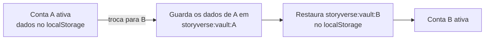

Os livros importados (IndexedDB) guardam o `owner` em cada registro, e cada conta vê só os seus.
Caches que não são pessoais (traduções, retratos, elenco) são compartilhados pelo aparelho.

### Sincronização — `cloudSync.ts` + tabela `reading_state`

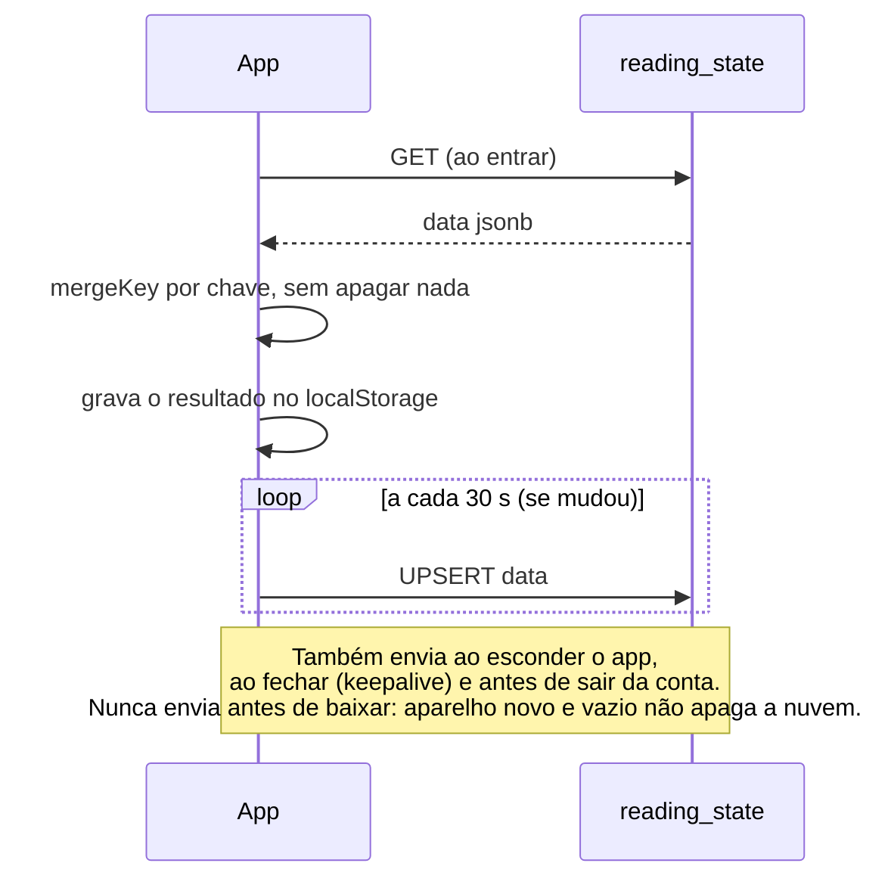

Regras de junção:

| Chave | Como junta |
|---|---|
| `reading-progress` | por livro, fica o lido mais recentemente (`updatedAt`) |
| `reading-stats` | por dia, o maior número de minutos |
| `streak-meta` | escudos: o maior; dias salvos: união |
| `finished-books` | todos, com a primeira data |
| `highlights:*` | todas as marcações (pelo id) |
| `chat:*` | a conversa mais recente |
| preferências (tema, meta, lembrete, voz…) | vale a deste aparelho |

Os **arquivos** dos livros importados não sobem (são grandes). Ao reinstalar, volta tudo menos o
texto importado.

---

## 9. Perfil: fotos e painel de leitura

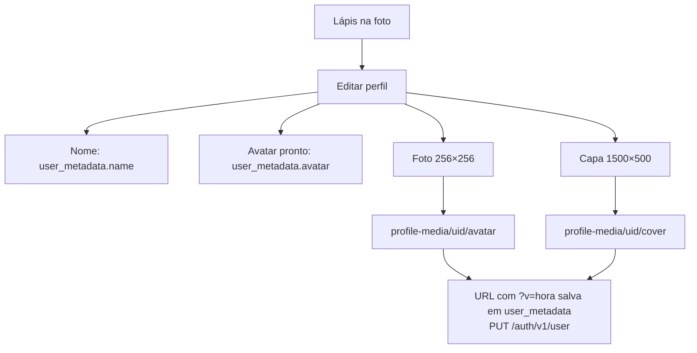

Painel (`ReadingDashboard`, dados de `readingStats.ts`):

- **Anel da meta** do dia (padrão de 10 min, com ✓ ao bater).
- **Chama** da sequência de dias, animada. A cada 7 dias seguidos ganha um escudo (máximo 2), que
  salva um dia sem leitura.
- **Barras da semana** com a linha da meta. Tocar numa barra mostra o dia.
- **Calendário** com a intensidade de leitura e ✓ nos dias que bateram a meta.
- Respeita "reduzir movimento" do sistema.

---

## 10. Chat com personagens (IA)

Código: `src/lib/ai.ts`, `cast.ts`, `portraits.ts`, `chatHistory.ts`, `usageLimit.ts`.

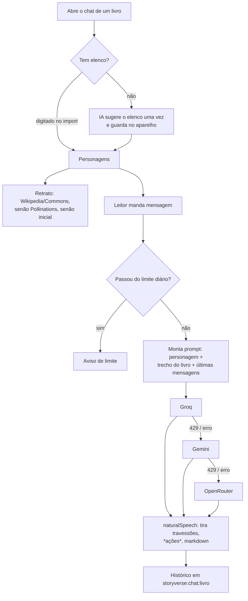

> As chaves `VITE_*` da IA ficam visíveis no navegador. O limite diário protege a cota, mas a trava
> de verdade precisa de uma função no servidor.

---

## 11. Pessoas online

`presence.ts`, com Supabase Realtime Presence (biblioteca baixada só quando precisa).

- Sala `app`: quantas pessoas estão com o app aberto. Só aparece para quem está logado.
- Sala `book:<id>`: quantas estão lendo o mesmo livro.
- Circula só o número. Cada conta conta uma vez, mesmo com várias abas. Com o app em segundo
  plano, a pessoa sai da contagem.

---

## 12. App instalável, offline e botão voltar

**Service worker** (`public/sw.js`, versão `v3`):

| Pedido | Estratégia | Cache |
|---|---|---|
| Páginas (HTML) | rede primeiro, cache se offline | `storyverse-shell-v3` |
| `/assets/*` e ícones | cache primeiro | `storyverse-shell-v3` |
| Texto do Gutenberg | cache primeiro (até 30 livros) | `storyverse-books-v1` |
| Capas, retratos, Wikimedia | mostra o cache e atualiza por trás (até 200) | `storyverse-images-v2` |
| Lembrete diário (Android) | periodic background sync | `sv-state` |

**Instalar** (`pwa.ts`): o botão some se o app já está aberto como app, se já foi instalado neste
aparelho, ou se o Chrome confirma (`getInstalledRelatedApps`).

**Botão voltar** (`backStack.ts`):

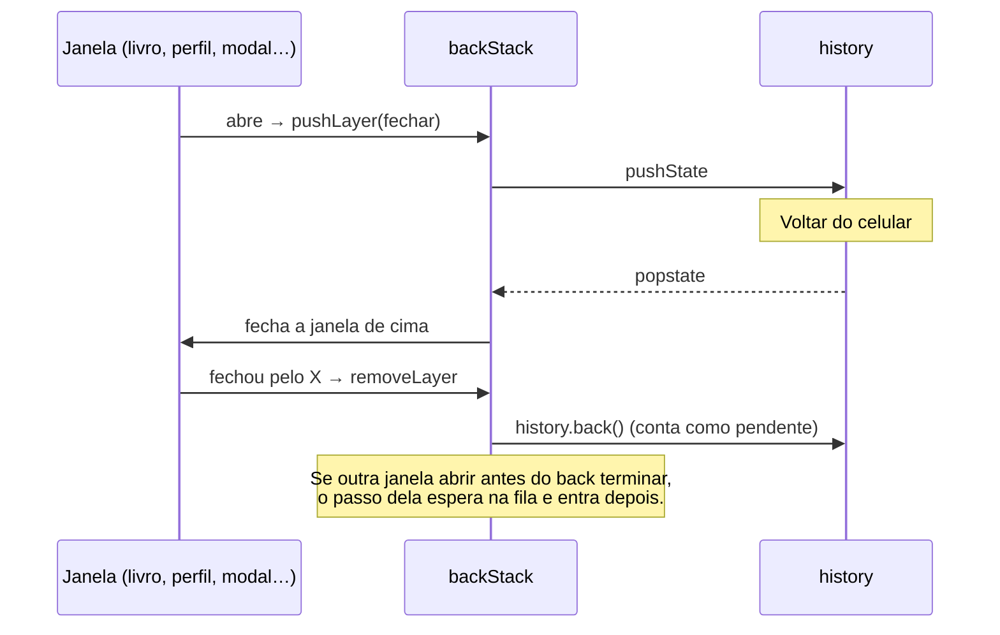

---

## 13. Banco de dados (Supabase)

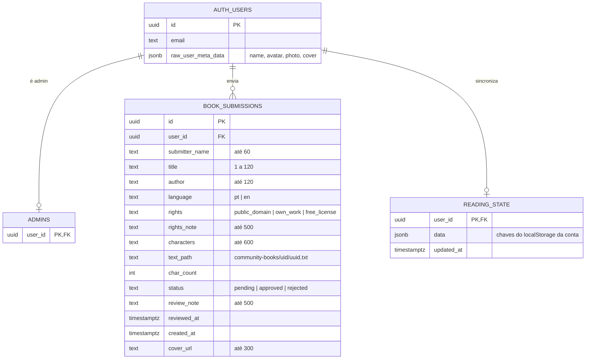

Índice: `book_submissions (status, reviewed_at desc)`. Todas as chaves estrangeiras usam
`on delete cascade`: apagar a conta apaga os dados dela.

### Regras de acesso (RLS)

| Tabela | Ver | Criar | Alterar | Apagar |
|---|---|---|---|---|
| `admins` | só a própria linha | — | — | — |
| `book_submissions` | aprovados: todos; os seus; admin: todos | logado, em nome próprio, como `pending` | só admin | admin; quem enviou enquanto `pending` |
| `reading_state` | só o dono | só o dono | só o dono | — |

Função `public.is_admin()` (`security definer`), liberada para `anon` e `authenticated`.
Função `public.set_submission_cover(id, url)` (`security definer`, só `authenticated`): quem enviou
troca a capa do próprio envio, só por uma imagem em `profile-media/<uid>/livros/`. Tabelas
novas precisam de `GRANT` para a API: está nos scripts.

---

## 14. Storage (arquivos)

| Bucket | Público | Limite | Tipos | Caminhos |
|---|---|---|---|---|
| `community-books` | não | 10 MB | `text/plain` | `<uid>/<uuid>.txt` |
| `profile-media` | sim | 2 MB | WebP, JPEG, PNG | `<uid>/avatar` · `<uid>/cover` · `<uid>/livros/<uuid>` |

Regras:

- **community-books**
  - Enviar: só na própria pasta.
  - Ler: dono, admin, ou qualquer um se o livro está aprovado.
  - Apagar: admin, ou o dono enquanto não aprovado.
- **profile-media**
  - Ler: todos.
  - Enviar, trocar, apagar: só na própria pasta.
  - Admin também apaga em `*/livros/*` (capas de envios).

O app reduz as imagens antes de subir: perfil ~20 KB, capa de livro ~20–40 KB, capa do perfil
~100 KB.

O banco guarda só os dados (envios, progresso): `cover_url` tem no máximo 300 caracteres, então
imagem nunca vai para o banco. Arquivos ficam no Storage. O painel de uso do Supabase mostra em GB
e atualiza com atraso, então alguns MB aparecem como "0 GB".

---

## 15. Dados guardados no aparelho

**localStorage** (prefixo `storyverse:`):

| Chave | O quê | Por conta | Sobe p/ nuvem |
|---|---|---|---|
| `supabase-session` | sessão (tokens) | — | não |
| `data-owner`, `data-legacy-owner` | conta ativa / dona dos dados antigos | — | não |
| `vault:<uid>` | cofre das outras contas | — | não |
| `reading-progress` | onde parou em cada livro | sim | sim |
| `reading-stats`, `streak-meta`, `reading-goal` | minutos, sequência, meta | sim | sim |
| `finished-books` | livros terminados | sim | sim |
| `highlights:<livro>` | marcações | sim | sim |
| `chat:<livro>`, `chat-index`, `last-character` | conversas | sim | sim |
| `reading-prefs`, `voice-prefs`, `reminder` | preferências | sim | sim |
| `ol-covers-v3` | capas achadas na Open Library | não | não |
| `tr2:*` | traduções | não | não |
| `portraits` | retratos dos personagens | não | não |
| `usage` | limite diário de mensagens | não | não |
| `app-installed` | app já instalado | não | não |

**IndexedDB** `storyverse-books` → store `books`: `{ book, text, images, owner }`.

---

## 16. Serviços externos e proxies

| Serviço | Para quê | Como chega |
|---|---|---|
| gutenberg.org | textos, capas, busca OPDS | proxy `/gutenberg/*`, `/gutenberg-search` |
| aleph.pglaf.org | espelho do Gutenberg | proxy `/gutenberg-mirror/*` |
| openlibrary.org | busca de capa e ano de publicação | proxy `/openlibrary/*` |
| covers.openlibrary.org | imagem das capas | proxy `/ol-covers/*` |
| Groq, Gemini, OpenRouter | chat e sugestão de elenco | direto (chaves `VITE_*`) |
| Google Tradutor, MyMemory | tradução | direto |
| Wikipedia/Commons, Pollinations | retratos dos personagens | direto |
| Wiktionary | dicionário | direto |
| Google Agenda / .ics | lembrete de leitura | link / arquivo |

Os proxies estão em `vercel.json` (produção) e `vite.config.ts` (dev/preview). Existem porque
esses sites não liberam CORS, ou são bloqueados pelo navegador (ORB).

---

## 17. Variáveis de ambiente

| Variável | Obrigatória | Uso |
|---|---|---|
| `VITE_SUPABASE_URL` | para contas | endereço do projeto |
| `VITE_SUPABASE_ANON_KEY` | para contas | chave pública (`sb_publishable_…`) |
| `VITE_LOGIN_REQUIRED` | não | `false` deixa a conta opcional |
| `VITE_SUPABASE_EMAIL_OTP_ENABLED` | não | `true` ativa código por e-mail |
| `VITE_GROQ_API_KEY`, `VITE_GROQ_MODELS` | não | IA, 1ª opção |
| `VITE_GEMINI_API_KEY`, `VITE_GEMINI_MODEL` | não | IA, 2ª opção |
| `VITE_OPENROUTER_API_KEY`, `VITE_OPENROUTER_MODELS` | não | IA, 3ª opção |

> Nunca coloque a chave `service_role` / secret do Supabase no app: tudo que começa com `VITE_`
> vai para o navegador.

---

## 18. Mapa do código

| Arquivo | Responsabilidade |
|---|---|
| `src/App.tsx` | todas as telas e componentes (início, leitor, perfil, moderação, modais) |
| `src/data/ebooks.ts`, `types.ts` | acervo em destaque e tipo `Ebook` |
| `lib/auth.ts` | cadastro, login, renovação de sessão, metadados |
| `lib/community.ts` | envios, aprovação, acervo da comunidade, Novidades |
| `lib/profileMedia.ts` | reduzir imagem e subir/apagar no Storage |
| `lib/bookCovers.ts`, `openLibrary.ts` | capas e ano de publicação (Open Library) |
| `lib/cloudSync.ts` | sincronização com `reading_state` |
| `lib/dataOwner.ts` | separação de dados por conta no aparelho |
| `lib/localBooks.ts`, `importBook.ts` | livros importados (IndexedDB) e leitura de .txt/.epub/.pdf |
| `lib/gutenberg.ts`, `chapters.ts` | busca/baixa do Gutenberg e divisão em capítulos |
| `lib/progress.ts`, `readingStats.ts`, `finished.ts` | progresso, minutos, sequência, terminados |
| `lib/highlights.ts`, `shareCard.ts` | marcações e cartão para compartilhar |
| `lib/ai.ts`, `cast.ts`, `naturalSpeech.ts`, `chatHistory.ts`, `usageLimit.ts` | chat com personagens |
| `lib/portraits.ts` | retratos dos personagens |
| `lib/translate.ts`, `dictionary.ts`, `speech.ts` | tradução, dicionário, voz |
| `lib/presence.ts` | contagem de pessoas online |
| `lib/pwa.ts`, `public/sw.js`, `manifest.webmanifest` | instalação e offline |
| `lib/reminders.ts` | lembretes (agenda e notificação) |
| `lib/backStack.ts` | botão voltar |
| `supabase/*.sql` | tabelas, regras e buckets |
| `supabase/templates/*.html` | e-mails de confirmação e senha |

---

## 19. Configurar um Supabase novo

1. **Authentication → Providers → Email**: ativo, com confirmação por e-mail.
2. **Authentication → SMTP**: servidor próprio (o SMTP padrão tem limite baixo de envios).
3. **Authentication → Email Templates**: colar `supabase/templates/*.html`.
4. **Authentication → URL Configuration**: Site URL e Redirect URLs com o domínio da Vercel.
5. Fazer o cadastro da conta de admin no app.
6. **SQL Editor**, rodar nesta ordem (todos podem rodar de novo sem problema):
   1. `supabase/community-books.sql` (admins, envios, bucket de textos)
   2. `supabase/profile-media.sql` (bucket de fotos)
   3. `supabase/reading-state.sql` (sincronização)
7. Na Vercel: `VITE_SUPABASE_URL` e `VITE_SUPABASE_ANON_KEY`, depois fazer um novo deploy.
